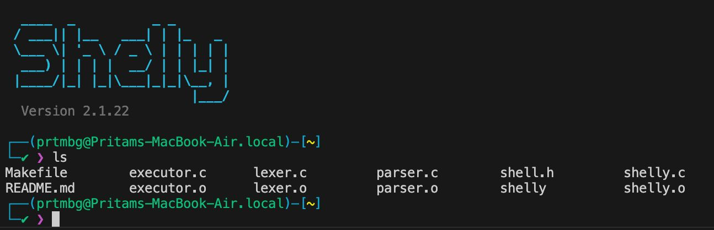
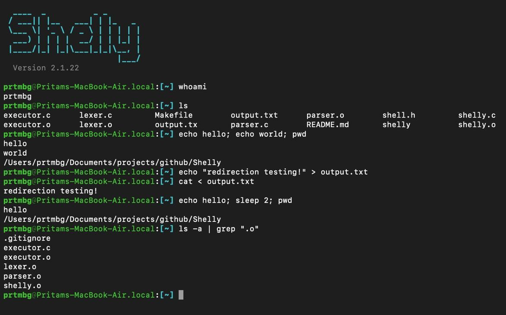

<div align="center">
  
</div>

# Shelly 
A custom shell for UNIX-based systems that handles both internal and external commands along with advanced shell features.

# Usage

## Requirements

To compile and run Shelly, you will need a UNIX-based environment (Linux, macOS, or WSL), along with:
- `gcc` (GNU Compiler Collection)
- `make` (Build automation tool)

## Compilation

Shelly comes with a simple `Makefile`. To build the shell, simply run:
```bash
make
```

To clean up compiled `shelly` and object files:
```bash
make clean
```

## Running the Shell

After compiling, you can start the interactive shell session by running:
```bash
./shelly
```

<div align="center">
  
</div>

## Architecture

Shelly is built with a highly modular codebase, mimicking the compilation pipeline of modern interpreters:
1. **Lexer (`lexer.c`)**: Reads the raw string input and safely tokenizes it (respecting quotes, spaces, and special operators).
2. **Parser (`parser.c`)**: A recursive-descent parser that consumes tokens and builds a complex Abstract Syntax Tree (AST).
3. **Executor (`executor.c`)**: Recursively walks the AST, setting up file descriptor redirections, pipelines (`pipe()`), and forking child processes (`fork()`, `execvp()`).
4. **History (`history.c`)**: Maintains in-memory and persistent command history (`~/.shelly_history`) with bash-like duplicate filtering and navigation support.
5. **Core (`shelly.c`)**: Manages the interactive REPL loop, dynamic input handling with full cursor & history navigation, and safely reaps zombie processes asynchronously via a `SIGCHLD` signal handler.

## Features and Examples

Shelly supports many modern POSIX-like features via its custom Abstract Syntax Tree (AST) parser:

### 1. Command History & Arrow Key Navigation
Navigate through previously executed commands just like in bash terminals:
- **Up Arrow (`↑`)**: Browse backwards to older commands.
- **Down Arrow (`↓`)**: Browse forwards to newer commands (restores any typed draft line at the bottom).
- **Persistent History**: Commands are saved to and loaded from `~/.shelly_history` across sessions.

### 2. File Redirection
Redirect standard input and output seamlessly:
```bash
echo "Hello, World!" > output.txt
cat < output.txt
echo "Appending text" >> output.txt
```

### 3. Pipelining
Chain multiple processes together where the output of one process becomes the input to the next:
```bash
cat output.txt | grep "Hello" | wc -l
```

### 4. Background Jobs
Run processes asynchronously in the background using `&` so your shell doesn't freeze:
```bash
sleep 10 &
```
*(Shelly safely cleans up finished background processes under the hood using a `SIGCHLD` handler to prevent zombie processes).*

### 5. Logical Operators & Sequences
Execute commands conditionally or sequentially:
```bash
# AND: Runs only if the first command succeeds
make && ./shelly

# OR: Runs only if the first command fails
cat invalid_file.txt || echo "File not found!"

# SEQUENCE: Runs commands sequentially unconditionally
echo "Starting..."; sleep 2; echo "Done!"
```

### 6. Quoted Arguments
Shelly natively understands single and double quotes, allowing you to process paths and arguments with spaces without breaking the tokenizer:
```bash
mkdir "My New Folder"
cd 'My New Folder'
```

### 7. Built-in Commands
Shelly handles the following commands internally without forking external processes:
- `cd <path>`: Change directory.
- `pwd`: Print working directory.
- `clear`: Clear the terminal screen.
- `history`: Display numbered command history (`history -c` to clear).
- `exit`: Safely terminate the shell.
